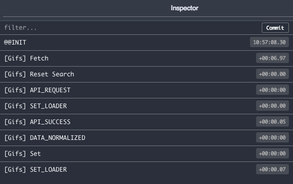

# redux-native-middleware-app

## Summary

I built this demo web app to showcase the simplicity of the native Redux middleware which many devs who use Redux aren't even aware exists. Redux middleware provides a third-party extension point between dispatching an action, and the moment it reaches the reducer. You can use it for logging, crash reporting, talking to an asynchronous API, routing, etc.

App is prototype of a GIF search engine with following features:
1. The app serves a page consisting of a simple form with a text field and a button.
2. A user can enter text to request some GIFs from the Giphy API.
3. When the API responds, the page is populated with GIFs.
4. A user can click a GIF to add it to their "favorites".
5. A user can view another page which displays their favorite GIFs.

## Run

1. `yarn install`
2. `yarn start`

## Tech Stack

1. React 16
2. Redux 4
3. React-Router 4
4. TypeScript 
5. Webpack 4 - Custom Config
6. Babel
7. Styled-Components
8. Ramda
8. Jest + Enzyme for testing :)

## Redux Middleware is the heart. It's all about Action processing! Because you might not need thunks or sagas. 

# redux-native-middleware-demo-app
